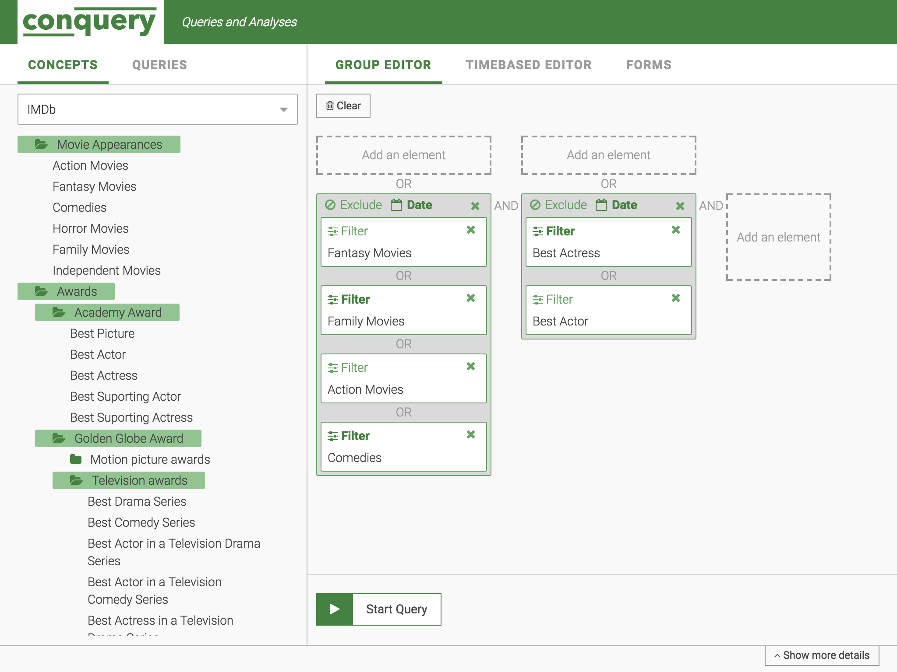

# Conquery
*fast & efficient Analysis*



Branch | Travis CI  | Heroku
------ | ---------- | ------
master  | [](https://travis-ci.org/bakdata/conquery) | [](https://conquery.herokuapp.com/) | 
develop  | [](https://travis-ci.org/bakdata/conquery) | [](https://conquery-dev.herokuapp.com/) |

Conquery provides a powerful web-based platform to compose and execute queries against large event-like data sets.

Event data sets typically associate events with a certain subject (i.e. a person or a physical object). One common use case for the data is to identify groups of similar subjects based on the assumption that they share similar events in a given time frame.

As a result, Conquery provides a powerful mechanism to group and classify event types in a hierarchical *concept tree* structure. Elements of this tree represent a group of similar subjects and can be intuitively selected and arranged to run queries against the data set.

## Starting the demo

This repository includes the Conquery frontend along with a non-functional backend. It provides a set of example concept trees to demonstrate the capabilities of the UI: The example's use case is to search for groups of actors who appeared in movies of the same genre or received the same award.

The demo can be started using the following commands, provided that node.js (version 8.x LTS) and yarn are already installed:

```sh
cd frontend/
yarn install
yarn start
```

## Acknowledgements

This platform was created by [InGef – Institut für angewandte Gesundheitsforschung Berlin GmbH](http://www.ingef.de/) in cooperation with [bakdata GmbH](http://www.bakdata.com).

[](http://www.ingef.de/)
&emsp;
[](http://www.bakdata.com)
