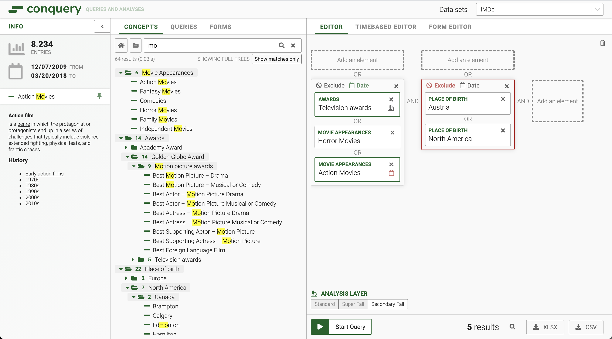

# Conquery
*fast & efficient analysis*

Conquery is a powerful web-based tool to compose and execute queries against large event-like data sets.

Event data sets typically associate events with a certain subject (i.e. a person or a physical object). One common use case for the data is to identify groups of similar subjects based on the assumption that they share similar events in a given time frame.

Conquery supplies a powerful interface to group event types in a hierarchical *concept tree* structure. Elements of this tree represent a group of similar subjects. Those subjects can be composed into a powerful query that runs against the data set.

## Starting the demo

### Frontend only

This repository includes the Conquery frontend along with a non-functional backend. It provides a set of example concept trees to demonstrate the capabilities of the UI: The example's use case is to search for groups of actors who appeared in movies of the same genre or received the same award.

Check the README in `/frontend` for details.

### Conquery (Frontend + Backend)
#### **Requirements**
- Maven 3 (optional for building)
- Java JDK 11
- Node.js 16 + Yarn

#### **Steps**
To test frontend and backend together you can start the setup that is used for end-to-end tests.

First build the backend using `scripts/build_version.sh` or download a JAR from the [release page](https://github.com/bakdata/conquery/releases).

Then start frontend and backend by running `scripts/run_backend_cypress.sh`.

As soon as the backend is up (after a few seconds), run `scripts/load_test_data_cypress.sh` to populate some test data.

After that, you can visit http://localhost:8081/admin-ui and explore the Admin Panel. Here you can see the test datasets and users that were populated.

When the frontend finished its build, you should be able to access it at http://localhost:3000 as the default "superuser" implicitly. Since the backend uses a development authentication, you can switch users by passing another users "UserId" as the access token in the query string when accessing the frontend, e.g.: http://localhost:3000/?access_token=user.user2.

## Development

### Testing
The projects consits of isolated frontend and backend tests, and end-to-end tests powered by cypress. Please refer to the corresponding [CI configuration](https://github.com/bakdata/conquery/tree/develop/.github/workflows) to learn about invoking the tests.

## Acknowledgements

This platform was created by [InGef – Institut für angewandte Gesundheitsforschung Berlin GmbH](http://www.ingef.de/) in cooperation with [bakdata GmbH](http://www.bakdata.com) and [Kai Rollmann](https://kairollmann.de/).

&emsp;

&emsp;

