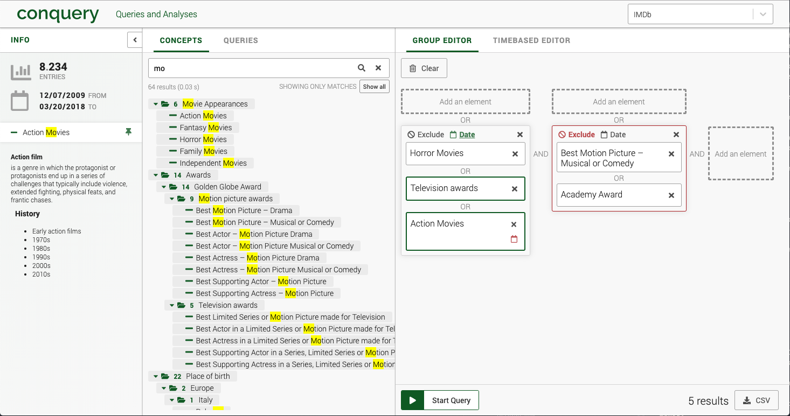

# Conquery
*fast & efficient analysis*

[](https://github.com/bakdata/conquery/releases/latest)
[](https://dev.azure.com/bakdata/public/_build/latest?definitionId=7&branchName=develop)
[](https://www.codefactor.io/repository/github/bakdata/conquery)


[](https://github.com/bakdata/conquery/blob/develop/LICENSE)

[Live-Demo](https://conquery.herokuapp.com/app/static) 



Conquery is a powerful web-based tool to compose and execute queries against large event-like data sets.

Event data sets typically associate events with a certain subject (i.e. a person or a physical object). One common use case for the data is to identify groups of similar subjects based on the assumption that they share similar events in a given time frame.

Conquery supplies a powerful interface to group event types in a hierarchical *concept tree* structure. Elements of this tree represent a group of similar subjects. Those subjects can be composed into a powerful query that runs against the data set.

## Starting the demo

This repository includes the Conquery frontend along with a non-functional backend. It provides a set of example concept trees to demonstrate the capabilities of the UI: The example's use case is to search for groups of actors who appeared in movies of the same genre or received the same award.

The demo can be started using the following commands, provided that node.js (version 8.x LTS) and yarn are already installed:

```sh
cd frontend/
yarn install
yarn start
```

[Login](http://localhost:8000) with test:test

## Acknowledgements

This platform was created by [InGef – Institut für angewandte Gesundheitsforschung Berlin GmbH](http://www.ingef.de/) in cooperation with [bakdata GmbH](http://www.bakdata.com) and [Kai Rollmann](https://kairollmann.de/).

[](http://www.ingef.de/)
&emsp;
[](http://www.bakdata.com)
&emsp;
[](https://kairollmann.de)
