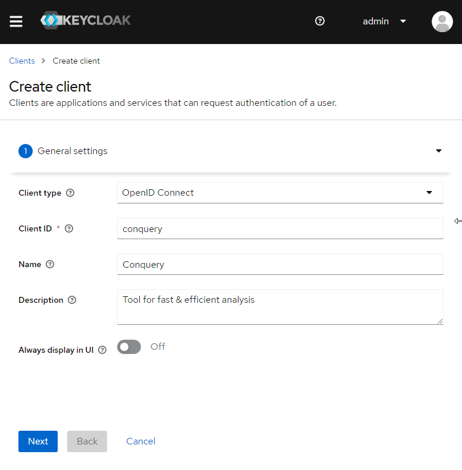
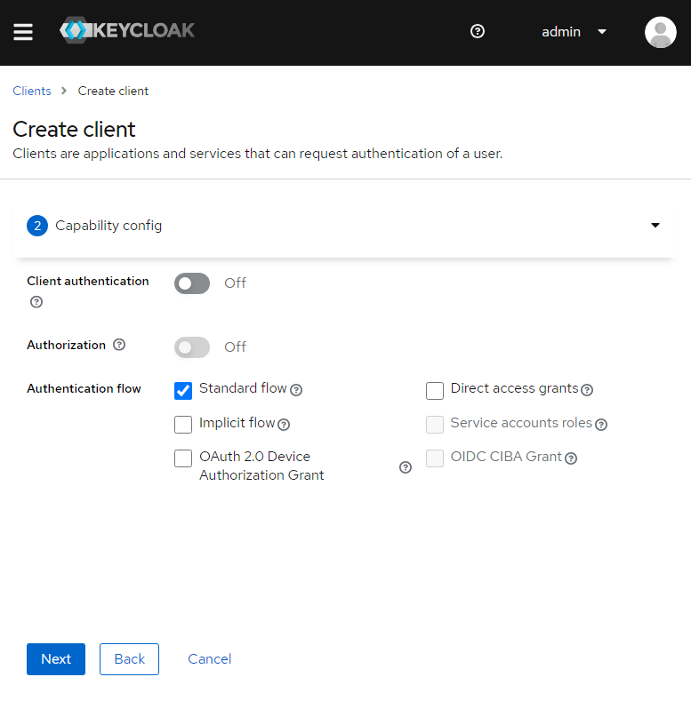
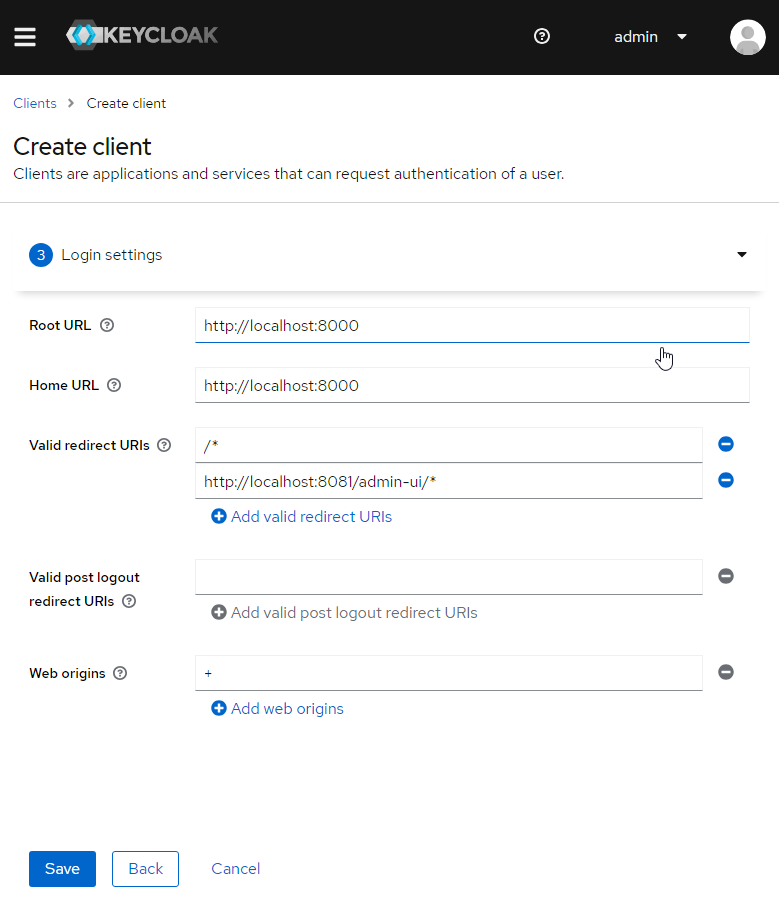
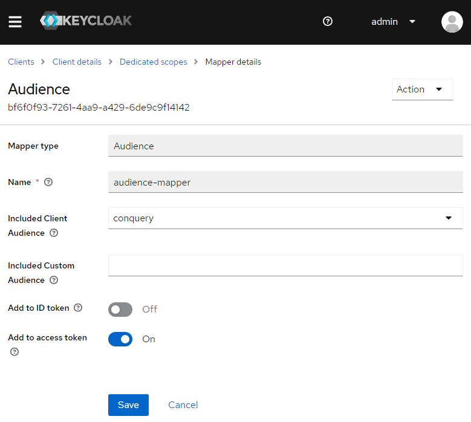

# Configure Authentication with OAuth2/OpenId Connect

We will discuss how to configure authentication with Keycloak, an open-source identity and access management tool, in
Conquery.
Using this configuration, Conquery's frontend acts as a public client, while the backend validates the provided tokens
offline.

## Prerequisites:

Before proceeding with the configuration process, ensure that you have the following prerequisites:

Conquery is installed and running on your system.  
The Keycloak server is installed and running on your system.  
You have administrative access to both Conquery and Keycloak.

## Configuration

To configure authentication with Keycloak in Conquery, follow these steps:

### Step 1: Create a Keycloak Realm (optional)
The first step is to create a new Keycloak realm where the later created Conquery client resides in. To create a new realm, follow these steps:

- Login to the Keycloak Administration Console using your administrative credentials.
- Click on the "Add Realm" button on the left sidebar.
- Enter a name for the new realm (e.g., Conquery).
- Click on the "Create" button.

Finally, you can retrieve the well-known url to the new realm which will be later referenced by `<realm-well-known-url>`.

### Step 2: Configure Keycloak Client

The next step is to configure a Keycloak client for Conquery. You can either import the [preconfigured OIDC-Client](./resources/conquery.json) or follow these steps:

1. In the Keycloak Administration Console, navigate to the Realm in which the client needs to be created.
2. Click on the "Clients" tab in the left sidebar and then click on the "Create" button.
3. Set the "Client Type" to "openid-connect". Enter a client id (e.g., conquery) and a name. Then click "Next".  
   
4. Configure the client as public, by only allowing the "Standard flow". Then click "Next".  
   
5. Set the Root and Home Url to point to the frontend (e.g. `http://localhost:8000`) and also add the AdminUI to the "Valid redirect URIs" (e.g. `http://localhost:8081/admin-ui/*`).
   
6. Click on the "Save" button.
7. After the Client is created, you need to add a special token mapper to the client that sets the `aud`-claim (Audience). In this case, we set the value to the name of the client (`conquery`), but you can also set it to the URL of the conquery backend server, which acts as the resource server.
   

### Step 3: Create Users (optional)
To use and adminster Conquery, you need at least one user with elevated rights.
Create a user in Keycloak and note its `id` (e.g. `c2382eae-e812-4b7e-8917-2e9ac010ee07`). This id is later configured in conquery to have special permissions.

### Step 4: Configure Conquery

The final step is to configure Conquery to use Keycloak for authentication. To do this, follow these steps:

- Open the Conquery configuration file (e.g., config.json) in a text editor to configure the backend.
  Add the following lines to the configuration file:
  ```json
    "authenticationRealms": [
        {
            "type" : "JWT_PKCE_REALM",
            "wellKnownEndpoint" : "<realm-well-known-url>",
            "client" : "<client-name>"
        }
    ]
    "authorizationRealms": {
        "type":"DEFAULT",
        "overviewScope": [
            "datasets",
            "forms",
            "admin",
            "*"
        ],
        "initialUsers": {
            "name":"<id>",
            "label":"Initial User",
            "permissions": [
                "*"
            ]
        }
    }
  ```
  Replace the `<realm-well-known-url>` and `<client-name>` with the names you used in Steps 1 and 2.
  Replace `<id>` with the user id of the user in Keycloak.
  The value of `client` is expected to appear in the `aud`-Claim of an access token. 

- Save the changes to the configuration file and restart the Conquery server.
- Assuming you are running the frontend in the provided docker container, you need to set the following environment
  variables, when running the container:
  ```bash
  docker run \
    --env REACT_APP_API_URL=<conquery-backend-url> \
    --env REACT_APP_IDP_REALM=<realm-name> \
    --env REACT_APP_IDP_CLIENT_ID=<client-name> \
    --env REACT_APP_DISABLE_LOGIN=true \
    --env REACT_APP_IDP_URL=<keycloak-server-url> \
    --env REACT_APP_IDP_ENABLE=true \
    --publish 8000:80 \
    ghcr.io/ingef/conquery-frontend
  ```

By following these steps, you can ensure that your Conquery instance is secure and protected from unauthorized access.